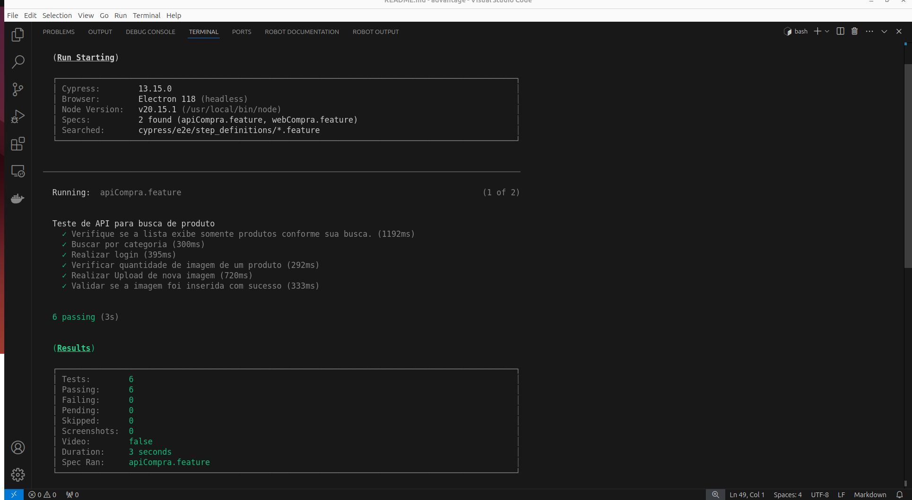
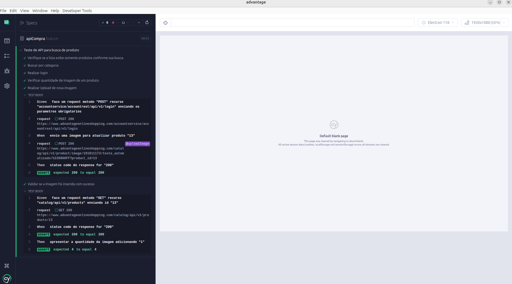
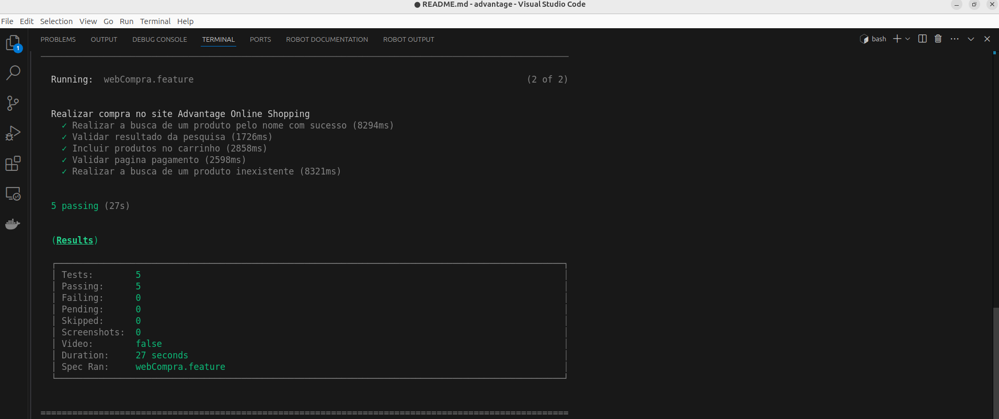
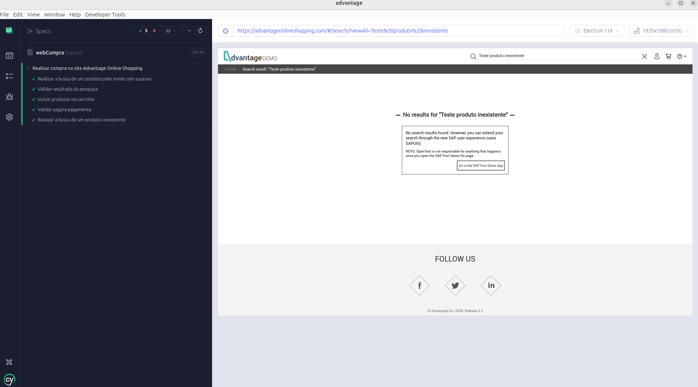

### Pré-requisitos 
- [Node.js](https://nodejs.org/en/download/package-manager)

### Inicializar um projeto npm
```
npm init -y
```
### Cofiguração package.json
* **main** foi alterado de index.js, para cypress.config.js
* **author** adicionado autor

### Dependências
* [Instalar o cypress como uma dependência de desenvolvimento](https://docs.cypress.io/guides/getting-started/installing-cypress)
```
npm install cypress --save-dev
```
* [Instalar cypress-cucumber-preprocessor] (https://www.npmjs.com/package/cypress-cucumber-preprocessor) 
```
npm install --save-dev cypress-cucumber-preprocessor
```
* [Instalar Cypress real events] (https://github.com/dmtrKovalenko/cypress-real-events)  
* **Observação:** dispara eventos do sistema, foi utilizado para validar animação da página resultado pesquisa.  
* Exemplo: Mover cursor sobre a imagem do produto, e validar o texto.
```
npm install cypress-real-events
```

## Como rodar os teste
- Após clonar o projeto e abrir vscode no terminalexecuta o comando npm install, e rodar os teste no modo interativo, ou em background.
```
npm install 
```

## Modo interativo
 
* No terminal do vscode digite o comando a seguir
```
npx cypress open
```
* Selecionar a opção E2E Testing
* Selecionar o Browser de sua preferência
* Selecionar spec que dejesa executar, apiCompra.feature ou webCompra.feature

## Modo headless
* No terminal do vscode digite o comando a seguir, os teste será executado em brackground.
```
npx cypress run
```

## Segue print após executar os testes
* Modo headles API
|

* Modo iterativo API
|

* Modo headles Web
|

* Modo iterativo Web
|